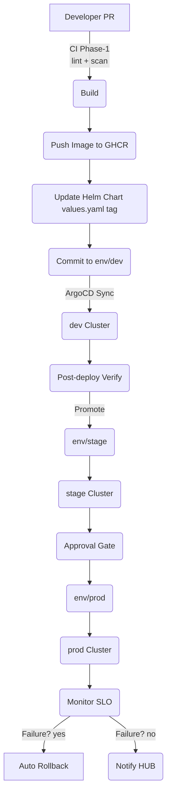

# ENG‑INFRA – Deployment Pipeline Design (v0.1)

| Version | Author    | Squad                      | Status    | Due                  |
| ------- | --------- | -------------------------- | --------- | -------------------- |
| 0.1     | ENG‑INFRA | Infrastructure Engineering | **Draft** | 2025‑06‑03 17:00 KST |

---

## 1. Purpose

This document proposes **Phase‑2** deployment pipeline architecture for Jarvis Lab Corp. It extends CI Phase‑1 (SAST · SBOM · SecretsScan) by introducing a GitOps‑driven CD flow, automated rollback, multi‑environment separation, and post‑deploy security hooks, aligning with HUB\_Guidelines.md.

## 2. Scope

* **Environments:** `dev` → `stage` → `prod` Kubernetes clusters (EKS/GKE)
* **Artefacts:** Application Docker images, Helm charts, Terraform modules
* **Tools:** GitHub Actions, Argo CD, Terraform, Helm, Kustomize, Trivy, Gitleaks, Syft, Loki/Prometheus

## 3. High‑Level Architecture

## 4. GitOps Workflow

1. **Source of Truth** – Three Git branches mirror environments: `env/dev`, `env/stage`, `env/prod`.
2. **Argo CD** watches each branch and reconciles K8s manifests (Helm/Kustomize overlays).
3. Promotion occurs via pull‑request between env branches; each promotion requires PASS:

   * **Smoke tests**
   * **Trivy runtime scan** (vuln+secret)
   * **SLO baseline** (latency ≤ 2 s, error ≤ 0.1 %)

## 5. Environment Separation

| Env       | Cluster               | Resources     | Traffic  | Data       | Autoscaling    |
| --------- | --------------------- | ------------- | -------- | ---------- | -------------- |
| **dev**   | shared‑eks‑dev        | spot nodes    | internal | mock       | off            |
| **stage** | shared‑eks‑stage      | on‑demand     | VPN      | anonymised | on             |
| **prod**  | prod‑eks‑blue & green | on‑demand+GPU | public   | prod RDS   | on + Karpenter |

*Secrets handled via **External‑Secrets + HashiCorp Vault**.*

## 6. Automatic Rollback Strategy

* **Blue‑Green** deployment toggled by Argo **AppSet**; 100 % traffic shift only after SLO pass.
* **Argo Rollouts** metrics‑based canary (5 % → 25 % → 100 %).
* **Rollback triggers**:

  * Error rate > 1 % during canary
  * Latency > 2 × baseline for 5 min
  * Custom PromQL alert `app_deploy_failure == 1`
* Rollback action: Argo Rollouts `abort` → previous ReplicaSet active, env/prod branch auto‑reverted.

## 7. Security Hooks (SBOM · SecretsScan)

| Stage             | Tool                   | Action                                  |
| ----------------- | ---------------------- | --------------------------------------- |
| **Build**         | Syft                   | Generate SBOM → `sbom.spdx.json`        |
| **Push**          | GitHub Upload Artifact | Attach SBOM to build                    |
| **Deploy**        | Trivy                  | Runtime scan image in cluster (CVE)     |
| **Post‑Deploy**   | Gitleaks               | Scan env branch diff for leaked secrets |
| **ArgoCD Plugin** | Trivy + Polaris        | Block sync if CVE severity ≥ High       |

SBOM and scan results published to **GitHub Security → Code Security** tab & linked in HUB weekly audit.

## 8. Detailed Pipeline Stages

| # | Stage                  | Runner                     | Key Steps                                    | Gates                           |
| - | ---------------------- | -------------------------- | -------------------------------------------- | ------------------------------- |
| 1 | **Build & Scan**       | GitHub Actions             | Docker build, `syft`, `trivy fs`, `gitleaks` | Hard‑fail on High CVE or secret |
| 2 | **Push**               | GitHub Actions             | Push to GHCR, tag with SHA & semver          | –                               |
| 3 | **Chart Update**       | GH Action                  | Helm chart `values.yaml.image.tag` bump      | –                               |
| 4 | **Dev Deploy**         | ArgoCD                     | Auto sync env/dev                            | Smoke test pass                 |
| 5 | **Stage Promotion**    | Git PR                     | Manual approval + template                   | All smoke, SLO pass             |
| 6 | **Stage Deploy**       | Argo Rollouts              | Canary + metrics                             | Auto rollback on alert          |
| 7 | **Prod Promotion**     | GitHub PR                  | Requires lead approval                       | –                               |
| 8 | **Prod Deploy**        | Argo Rollouts              | Blue‑Green switch                            | Auto rollback                   |
| 9 | **Post‑Deploy Verify** | GitHub Action + Prometheus | SLO, E2E tests                               | HUB summary                     |

## 9. Notifications & Reporting

* **Slack** – CI/CD status updates via `jarvis‑ci` channel
* **PagerDuty** – Rollout alerts, rollback events
* **HUB Upload** – GitHub Actions job `publish‑hub‑report` pushes Markdown summary to `HUB/ENG-INFRA` path

## 10. KPIs & SLA Mapping

| Goal                 | KPI                  | Target   |
| -------------------- | -------------------- | -------- |
| Deployment lead‑time | *Commit → Prod*      | ≤ 30 min |
| Mean Time to Restore | *Failure → Healthy*  | ≤ 10 min |
| Change fail rate     | Failed deploys/total | ≤ 5 %    |

## 11. Open Questions / To‑Do

1. Choose **Kubernetes version upgrade cadence**
2. Finalise **multi‑arch image support** (arm64?)
3. Integrate **OPA/Gatekeeper**policies at sync time
4. Confirm **cost impact** of blue‑green double capacity with FIN

## 12. Appendices

* **A. References**: docs/HUB\_Guidelines.md, ci\_phase1.yml, Trivy/Argo Rollouts docs
* **B. Glossary**: SLO, SBOM, GitOps, MTTR

---

*© 2025 Jarvis Lab Corp. – Internal Use Only*
